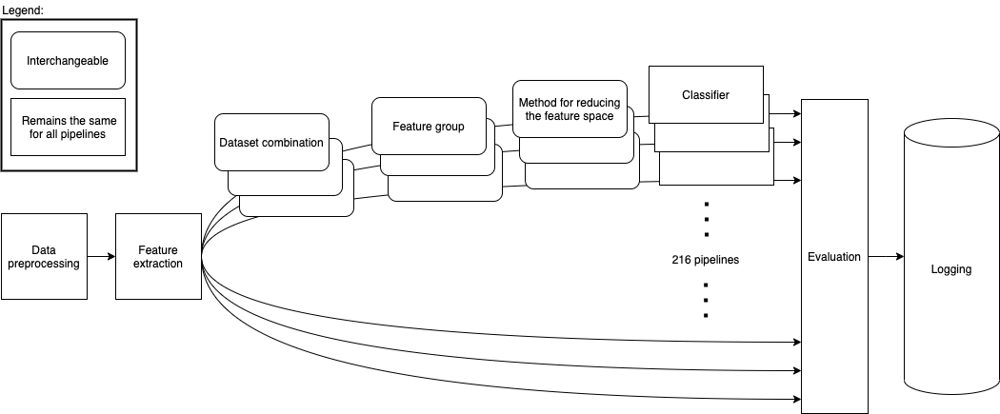
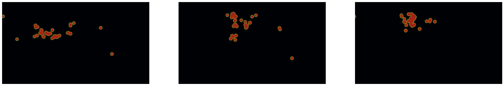
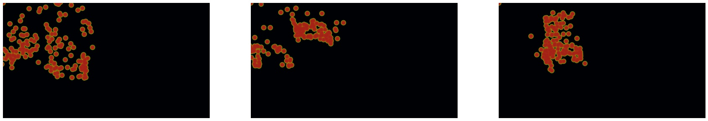

[[implementation]]
== Implementation

Our goal is to create a platform on which we can perform our feature generalizability experiments efficiently and consistently.

In order to achieve this goal, multiple components have to be present.

. We need methods to standardize datasets so the units are the same and the data is in the same form.
. We need to clean the data to achieve high data quality, which can produce good features.
. We need a platform that can generate computationally expensive features for multiple large datasets.
. We need a platform that can run multiple concurrent pipelines for combinations of datasets, features, and methods for dimensionality reduction.
. We need an evaluation step that collects the results from all the pipelines and can prove pipelines generalizable.
. We need reproducibility.

xref:architecture_diagram[] shows the outlines of the architecture we propose.
The first step is data preprocessing, explained in xref:preprocessing[].
Preprocessed data is then fed to the feature extraction step explained in xref:feature_extraction[].
Then we organize 216 separate pipelines that consist of unique combinations of datasets, feature groups, and methods for reducing the feature space explained in xref:pipelines[].
All pipelines use the same ensemble classifier.
Results are then evaluated in the evaluation step (see xref:evaluation[]), and logged (see xref:reproducibility[]).

[[architecture_diagram]]
.Diagram of our architecture.


[[preprocessing]]
=== Preprocessing

This subsection explains how we achieved goals 1 & 2 of creating a platform for generating generalizable features.

> We need methods to standardize datasets so the units are the same and the data is in the same form.

> We need to clean the data to achieve high data quality, which can produce good features.

==== Standardization of Datasets
We use three datasets from different experiments with different contexts.
Each dataset has its own set of column names, and they also use different units.
Some of the datasets measure time in milliseconds, while others measure it in microseconds.
In standardizing the dataset, we converted all differing units and renamed columns that represented the same values so that all datasets are consistent with each other.
Some subjects were missing labels; this was solved by removing the subject from the dataset.

For the EMIP dataset, we were provided with the raw data without fixations calculated.
In order to use this dataset, we calculated fixations ourselves with the library PyGaze Analyzer citenp:[dalmaijerPyGazeOpensourceCrossplatform2014].
The algorithm used is a dispersion-based algorithm that requires us to set the maximum distance and minimum duration for a fixation.
We set the minimum duration by finding the minimum duration of fixations from our two other datasets.
Pieter Blignaut citenp:[blignautFixationIdentificationOptimum2009] suggests that the maximum distance of a fixation when using a dispersion algorithm for finding fixations should be 1º of the foveal angle.
The distance between the subject and the stimulus was 700 mm for EMIP; thus, 1º of the foveal angle works out to about 45 pixels.
We only used fixations where the subject was reading code and disregarded data gathered during setup and calibration.

==== Normalization and Outlier Removal

As our subjects come from multiple contexts, the need for normalization and outlier removal is extra apparent.
It is essential to normalize pupil diameter.
Pupil diameter can be affected by several factors such as lighting conditions and how well-rested the subject is citenp:[pflegingModelRelatingPupil2016].
We chose to min-max normalize the pupil diameter in the range of 0 to 1 per subject.
To mitigate some contextual biases we use a rolling mean with a window size of 100 samples to smooth the timeseries.

Our time recordings are made at the start point of each fixation.
This can be problematic, as there are situations where more time passes between fixations than would be reasonable for regular saccades.
This might be due to blinking, the subject looking outside the range of the eye-tracker, or technical malfunction.
To mitigate this, we remove the outliers by setting a threshold of 1000 ms for saccade duration.
All gaps in time over 1000ms were reduced to 1000ms.


[[feature_extraction]]
=== Feature Extraction
This subsection explains how we achieved goal 3.

> We need a platform that can generate computationally expensive features for multiple large datasets

We will present the flow of the feature extraction process and discuss the specific features we extract.
The features are organized into three sections:

* Timeseries Features
* Gaze Characteristics
* Heatmap features

==== Flow

The flow of the feature extraction job is as follows:

. Download the datasets from google cloud storage.
. Standardize and normalize data.
. Generate aggregated attributes, such as saccade duration and saccade_length.
. Smooth the signal with rolling mean.
. Generate features.
. Upload features to google cloud storage.

==== Timeseries Features

After preprocessing, our dataset includes several different eye-tracking variables.
The variables we use are pupil diameter, fixation duration, saccade duration, and saccade length.
We interpret these signals with different timeseries modeling techniques, which are elaborated upon in this section.

From each of these signals, we calculate five features.

* Power Spectral Histogram.
* ARMA.
* GARCH.
* Hidden Markov Models.
* LHIPA.

===== Power Spectral Histogram

The power spectrum decomposes the timeseries into the frequencies in the signal and the amplitude of each frequency.
Once computed, they can be represented as a histogram called the power spectral histogram.
We computed the centroid, variance, skew, and kurtosis of the power spectral histogram.

The power spectral histogram describes the repetition of patterns in the data.
We hypothesize that similar pattern repetitions will be present in subjects that display a high cognitive performance across contexts.

===== Autoregressive Moving Average model (ARMA)

We know that a cognitive process takes place over a span of time, and our gaze data is organized as a timeseries.
If our goal is to model cognitive workload, we need to capture the temporal aspects of cognition.
ARMA combines an auto-regressive part and a moving average part to model movements in a timeseries.
It uses information for previous events to predict future events with the same source.

An ARMA process describes a time series with two polynomials.
The first of these polynomials describes the autoregressive (AR) part of the timeseries.
The second part describes the moving average (MA).
The following formula formally describes ARMA:

asciimath:[X_t = sum_(j=1)^p phi_j X_(t-j) + sum_(i=1)^q theta_i epsilon_(t-i) + epsilon_t]


The features we extract from ARMA are extracted with the following algorithm


```
best_fit = null
for p up to 4
    for q up to 4
        fit = ARMA(timeseries, p, q)
        if(best_fit.aic > fit.aic)
            best_fit = fit
return best_fit["ar"], best_fit["ma"], best_fit["exog"]
```

===== Generalized AutoRegressive Conditional Heteroskedasticity (GARCH)

GARCH is similar to ARMA, but it is applied to the variance of the data instead of the mean.

ARMA assumes a uniform distribution of the events it is modeling with shifting trends.
However, we know that this is not entirely descriptive of cognitive processes.
When working with a cognitive task, one has periods of intense focus to understand one aspect of the problem and other periods where one's mind rests.
The heteroskedasticity aspect of GARCH accounts for this grouping of events.
In the analysis of financial markets, GARCH can account for the spikes and sudden drops in prices of specific investment vehicles citenp:[bollerslevGeneralizedAutoregressiveConditional1986], we posit that GARCH will allow us to model the perceived grouping of cognitive workload spikes in a like manner.

We extract features from GARCH similar to how we extract features from ARMA.

```
best_fit = null
for p up to 4
    for q up to 4
        fit = GARCH(timeseries, p, q)
        if(best_fit.aic > fit.aic)
            best_fit = fit
return [best_fit["alpha"],
       best_fit["beta"],
       best_fit["gamma"],
       best_fit["mu"],
       best_fit["omega"]]

```


===== Hidden Markov Models (HMM)

Hidden Markov Models contains the Markov assumption, which assumes that the present value is conditionally independent on its non-ancestors given its n last parents.
Similarly to ARMA, this means that the current value is a function of the past values.
While ARMA models continuous values, HMM is discrete.
Hence we discretize the values into 100 buckets before we model the transitions between these buckets with HMM.
We then use the resulting transition matrix as the feature.

The reasoning behind using HMM is the same as to why we chose ARMA.
We hypothesize that HMM might model the changing state nature of cognitive work.

```
normalized_timeseries = normalize the timeseries between 0 and 1
discretized_timeseries = discretize timeseries in 100 bins
best_fit = null
for i up to 8
   fit = GaussianHMM(covariance_type="full")
        .fit(discretized_timeseries, n_components=i)
   if(best_fit.aic > fit.aic)
        best_fit = fit
flat_transistion_matrix = best_fit.transition_matrix.flatten()
padded_transition_matrix =
    pad flat_transistion matrix with n zeroes so the length is 64
return padded_transition_matrix
```

===== The Low/High Index of Pupillary Activity (LHIPA)

LHIPA citenp:[duchowskiLowHighIndex2020] enhances the Index of Pupillary Activity citenp:[duchowskiIndexPupillaryActivity2018], which is a metric to discriminate cognitive load from pupil diameter oscillation.
LHIPA partially models the functioning of the human autonomic nervous system by looking at the low and high frequencies of pupil oscillation.

Cognitive load has been shown to correlate with cognitive performance citenp:[hebbDrivesConceptualNervous1955].
The Yerkes-Dodson law describes the relationship between the two, indicating an optimal plateau where a certain degree of cognitive workload is tied to maximized cognitive performance.
If the cognitive workload is increased beyond this point, cognitive performance is diminished citenp:[hebbDrivesConceptualNervous1955].

Our implementation of LHIPA is based on the code found in citenp:[duchowskiLowHighIndex2020, duchowskiIndexPupillaryActivity2018].

==== Gaze Characteristics

Gaze Characteristics are features that are interpreted directly from the eye-tracking data and are not subject to additional signal processing.

===== Information Processing Ratio

Global Information Processing (GIP) is often analogous with skimming text.
When skimming, one's gaze jumps between large sections of the material and does not stay in place for extended periods.
This manifests as shorter fixations and longer saccades.
Local Information Processing (LIP) is the opposite; one's gaze focuses on smaller areas for longer durations and does not move around as much.
For this metric, fixations are measured in time, while saccades are measured in distance.
Hence we capture both the spatial and temporal dimensions.

The information processing ratio describes how much a subject skimmed the material versus how much they focus intently.
To compute the ratio, we divide GIP by LIP.

The following algorithm extracts the feature:

```
upper_threshold_saccade_length = 75 percentile of saccade_lengths
lower_threshold_saccade_length = 25 percentile of saccade_lengths
upper_threshold_fixation_duration = 75 percentile of fixation_durations
lower_threshold_fixation_duration = 25 percentile of fixation_durations

LIP = 0
GIP = 0
for s_length, f_duration in saccade_lengths, fixation_durations
    fixation_is_short = f_duration <= lower_threshold_fixation_duration
    fixation_is_long = upper_threshold_fixation_duration <= f_duration
    saccade_is_short = s_length <= lower_threshold_saccade_length
    saccade_is_long = upper_threshold_saccade_length <= s_length

    if fixation_is_long and saccade_is_short:
        LIP += 1
    elif fixation_is_short and saccade_is_long:
        GIP += 1

return GIP / (LIP + 1)
```

[[skewness_saccade_speed]]
===== Skewness of Saccade Speed

Saccade velocity skewness has been shown to correlate with familiarity citenp:[pappasVisualAestheticsECommerce2018a].
If the skewness is highly positive, that means that the overall saccade speeds were high.
This indicates that the subject is familiar with the stimulus and can quickly maneuver to the relevant sections when seeking information.
Saccade speed does not necessarily indicate expertise in the relevant subject matter.
A non-expert participant could be familiar with the material and hence know where to look for information, but an expert would also quickly assert what information they are seeking.

To calculate this feature, we calculated the speed by dividing the saccade length by the saccade duration.
We then got the skew of the outputted distribution.

```
get_skewness_of_saccades(saccade_duration, saccade_length):
    saccade_speed = saccade_length / saccade_duration
    return saccade_speed.skew()

```

===== Verticality of Saccades

By verticality of saccades, we mean the ratio of saccades moving vertically over horizontally.
Our intuition for generating this feature is based on the difference between how we read code versus how we read text.
An experienced coder reads vertically, focusing on definitions and conditionals.
Traditional text, on the other hand, is read line by line in a horizontal fashion.
Based on this anecdotal observation, we are interested in how well the verticality of saccades would generalize.


To calculate the feature, we get the angle between every consecutive fixation with respect to the x-axis.
We do that with arctan2, which outputs the angle in radians between pi and -pi.
Since we are only interested in the verticality of the saccade, we take the absolute value of the angle.
To describe the horizontality of each point in a range between 0 and 1, we take the sine of every angle.

```
angles = atan2(y2 - y1, x2 - x1)

for angle in angles
   angle = sin(absolute_value(angle))

verticality = angles.average()
```

===== Entropy of Gaze

The entropy of gaze explains the size of the field of focus for a subject.
Entropy is higher when the subject's attention is more evenly spread over the stimulus and lower if the subject focuses on a minor part of the stimulus.

To calculate the entropy of gaze, we create a grid of 50 by 50 px bins.
We then normalize the x and y positions of each fixation in a range from 0 to 1000.
Further, we place each fixation in its corresponding bin, based on its x and y position.
When we have this grid, we flatten it and take the entropy of the resulting distribution.

The following algorithm extracts the feature:
```
x_normalized = normalize x between 0 and 1000
y_normalized = normalize y between 0 and 1000

x_axis = [50, 100, 150 ... ,1000]
y_axis = [50, 100, 150 ... ,1000]
2d_histogram = 2d_histogram(xaxis, yaxis, x_normalized, y_normalized)
return entropy(2d_histogram.flatten())

```

==== Heatmaps

A heatmap is a graphical representation of data where values are depicted by color.
Areas of higher activity will be highlighted more.
Our heatmaps represent the gaze position of a subject over time.
To capture both spatial and temporal data, we create multiple heatmaps for each subject.
Sharma et al. citenp:[sharmaEyetrackingArtificialIntelligence2020] show that deep features of heatmaps from gaze data can predict cognitive performance in learning activities.

These are the steps we take to create our heatmaps:

. Split the data from each subject into 30 partitions.
. Create a 1920 * 1080 image.
. Plot the gaze position with heatmappy citenp:[lumenresearchLumenResearchHeatmappy2021].
. Resize the image to 175 * 90.

.Three consecutive heatmaps without stimulus from CSCW.


.Three consecutive heatmaps without stimulus from EMIP.
image::../figures/emip_heatmaps.jpg[]

.Three consecutive heatmaps without stimulus from Fractions.


From the heatmaps used a pretrained vgg19 model citenp:[simonyanVeryDeepConvolutional2015] with the imagenet weights citenp:[krizhevskyImageNetClassificationDeep2017] to generate a feature vector per image.

. Scale images using the preprocess_input function provided by Keras citenp:[franccoischolletKeras2015]
. Use the pre-trained VGG-19 model to extract features per image
. Combine the matrices outputted by the VGG19 model to a single feature vector

```
frames = Split each subject into 30 partitions
features = []
for frame in frames
    image = image of with dimensions 1920, 1080
    heatmap = heatmappy.heatmap_on_img(frame.x_and_y_postions, image)
    scaled_down_heatmap = keras.applications.image_netutils(heatmap)
    heatmap_features = vgg19model.predict(scaled_down_heatmap)
    features.append(heatmap_feature.flatten())
return features.flatten()
```

==== Final Feature Set

After feature extraction, these are the features that are generated for each subject.

.Final feature set.
include::../tables/feature_set_table.adoc[]

[[pipelines]]
=== Pipelines

This section explains how we solved goal 4 of creating our platform.

> We need a platform that can run multiple concurrent pipelines for combinations of datasets, features, and methods for reducing the feature space.

By a pipeline, we mean a specific combination of datasets, feature groups, and methods for reducing the feature space (dimensionality reduction or feature selection).
We will refer to these parts as pipeline components.


==== Datasets

We have three different datasets: EMIP, Fractions, and CSCW.
As discussed in xref:study[], we designate either one or two datasets as in-study for each of our pipelines.
All pipelines include a single dataset as the out-of-study dataset.
No dataset is used twice in one pipeline.

We refer to the pipelines where one dataset is designated in-study as 1-to-1 pipelines, as these pipelines train on one dataset and test on another.
Pipelines, where two datasets are designated in-study, are referred to as 2-to-1 pipelines since we train on two datasets combined and test on one dataset.
We have three datasets, which make up nine dataset combinations, six of which create 1-to-1 pipelines and three go into 2-to-1 pipelines.

==== Feature Groups

Initially, we considered running pipelines to test all combinations of features.
These would prove to be unfeasible.
With 22 features, nine dataset combinations, and two methods of reducing the feature space, there would be 75 597 472 pipelines.
With a theoretical runtime of one second per pipeline, the total computing time necessary to tackle this challenge would be approximately two years, and we would not make our deadline for this thesis.

As an alternative, we decided to group our features manually.
We created one group for the gaze characteristics, four for the type of signal, and five for the different time series features.
In addition, we have a separate group for heatmaps and, lastly, one group that includes all the features.
The groups are presented in the following table:

.Feature groups and the features contained in them.
include::../tables/feature_groups_table.adoc[]

==== Reducing the Feature Space

Our pipelines perform either feature selection or dimensionality reduction to reduce the number of features and decrease variance.
The focus of our thesis was on testing different features, and as such, we decided not to test a wide range of alternatives.
The effect of different methods for reducing the feature space on generalizability is a potential area for further study.
The method we use for dimensionality reduction is Principal Component Analysis (PCA), and the one for feature selection is Least Absolute Shrinkage and Selection Operator (LASSO).
For all pipelines, we also use a zero-variance filter to remove the features that have no variance in their data

LASSO was selected as our feature selection algorithm because it has been shown to perform very well when the number of samples is less than the number of features citenp:[giannakosMultimodalDataMeans2019, tibshiraniRegressionShrinkageSelection1996], which is the case for most of our feature groups.


==== Prediction: Ensemble Learning

Our pipelines were tested with the same regressor, a weighted voting ensemble with a KNN-regressor, a Random forest regressor, and a Support Vector regressor.
An ensemble combines several different base regressors or classifiers in order to leverage the strengths of each classifier or regressor.
A voting regressor is an ensemble that fits several regressors, each on the whole dataset.
Then it averages the individual predictions respective to their given weights to form a final prediction.
To find the weights for the voting, we perform cross-validation, with the validation set, on each regressor and set their respective weights to 1 - Root Mean Square Error (RMSE).
Many studies have been published that demonstrate that ensemble methods frequently improve on the average performance of the single regressor citenp:[anOptimalWeightSelectionRegressor2009, kunchevaCombiningPatternClassifiers].

KNN predictors approximate the target by associating it with its n nearest neighbors in the training set.
KNNs are simplistic algorithms that, despite their simplicity, in some cases, outperform more complex learning algorithms.
However, it is also negatively affected by non-informative features citenp:[gulEnsembleSubsetKNN2016].
A random forest fits a number of classifying decision trees on various sub-samples of the dataset and aggregates the predictions from the different trees.
Random forests have been shown to outperform most other families of classifiers citenp:[fernandez-delgadoWeNeedHundreds2014].
SVR, support vector regressors are a regression version of support vector machines proposed by Drucker et al. citenp:[druckerSupportVectorRegression2003]
SVRs estimate the target value by fitting a hyperplane by minimizing the margins of the plane with an error threshold.
Support vector regressors perform particularly well when the dimensionality of the feature space representation is much larger than the number of examples citenp:[druckerSupportVectorRegression2003], which is the case for some of our feature groups.
All our hyperparameters are set to the default values provided by sklearn citenp:[pedregosaScikitlearnMachineLearning].

[[evaluation]]
=== Evaluation

This section will outline how we achieve the fifth goal of our platform:

> We need an evaluation step that collects the results from all the pipelines and can prove pipelines generalizable.

Models produced by our pipelines are evaluated in two ways, with out-of-sample testing and out-of-study testing.
Out-of-sample testing uses a subset of the in-study dataset to evaluate the predictive power of the model. Out-of-study testing uses the dataset designated as out-of-study to evaluate generalizability.
This subsection explains how we evaluate the results of each test.

==== Evaluation Criteria

We use Normalized Root Mean Squared Error (NRMSE) as our primary evaluation metric.
NRMSE is a probabilistic understanding of errors as defined by Ferri et al. citenp:[ferriExperimentalComparisonPerformance2009].
NRMSE is commonly used in learning technologies to evaluate learning predictions citenp:[moreno-marcosPredictionMOOCsReview2019]
The score in all our contexts is based on binary outcomes; a question is either correct or incorrect.
Pelánek et al. citenp:[pelanekMetricsEvaluationStudent2015] argue that for such cases, metrics such as Root Mean Squared Error (RMSE) or Log-Likelihood (LL) is preferred to metrics such as Mean Average Error (MAE) or Area Under the Curve (AUC).
MAE considers the absolute difference between the predictions and the errors and is not a suitable metric, as it prefers models that are biased toward the majority result.
RMSE, on the other hand, does not have this issue, as it is based on the squared value of each error, giving greater weight to larger errors in its average.
The main difference between RMSE and LL is the unbounded nature of LL, which means that it can very heavily punish models that confidently make incorrect assertions citenp:[pelanekMetricsEvaluationStudent2015].
While this can be preferred in some contexts, we decided to proceed with the more common RMSE measure.

The root part of RMSE serves to move the sum of errors back into the range of the labels being predicted to improve interpretability.
This might have limited usefulness as the resulting numbers can still be challenging to interpret citenp:[pelanekMetricsEvaluationStudent2015].
In our case, the labels exist in three different contexts with labels in different ranges, and since we are working across these contexts, we need normalized values.
Since we normalize the labels in a range from 0 to 1 before training, RMSE is equivalent to Normalized RMSE (NRMSE).
Our NRMSE is normalized between 0 and 1, where 1 is the maximum error possible for the dataset.

The following formulas calculate NRMSE.

asciimath:[RMSE = sqrt ((sum_(i=1)^text(Number of samples) (text(predicted)_i - text(original)_i)^2) / text(Number of Samples))]

asciimath:[NRMSE = text(RMSE)/(text(original)_max - text(original)_min)]


[[feature_generalizability_index]]
==== Feature Generalizability Index (FGI)

Our measure for generalizability was proposed by Sharma et al. citenp:[sharmaAssessingCognitivePerformance2020].
We measure the generalizability of features by comparing the distributions of NRMSE values from the out-of-sample testing and the out-of-study testing.
Since the ground truth in both the in-study datasets and the out-of-study datasets indicate cognitive performance, we can assume that similar behavior will indicate similar results.
To compare the distributions of NRMSE, we use analysis of similarity (ANOSIM), which is a non-parametric function, to find the similarity of two distributions citenp:[clarkeNonparametricMultivariateAnalyses1993].

asciimath:[(text(mean ranks between groups ) - text( mean ranks within groups))/(N(N - 1)/4)]

The denominator normalizes the values between -1 and 1, where 0 represents a random grouping.
Pipelines that have an FGI value closer to zero are more generalizable citenp:[sharmaAssessingCognitivePerformance2020].

[[reproducibility]]
=== Reproducibility

This section explains how we reached the sixth goal of our platform.

> We need reproducibility.

Our reproducibility strategy primarily consists of four components.
The version-control tool, git; the machine learning management tool, comet.ml; the python package management tool, poetry; and google cloud platform.


==== comet.ml

comet.ml is a machine learning management tool citenp:[comet.mlCometMLHome2021].
It can handle user management, visualization, tracking of experiments, and much more.
We use comet.ml to track the results of our experiments, the relevant hyperparameters, the git commit hash, which indicates our software state, and the virtual machine on the google cloud platform which executed the code.

==== Poetry

Poetry is a dependency manager for python citenp:[PoetryPythonDependency].
As with any large software project, our platform relies on several third-party libraries.
To ensure both reproducibility and ease of use and development, we use poetry to track the versions of the libraries we use.
Poetry stores these versions in a lock-file which is tracked by git.

==== Git

Git keeps track of all versions of our source code citenp:[Git].
We have set up safeguards that ensure that all changes to the local code are committed before a run can begin.
In addition, all parameters of experiments are represented in the code.
As a result, the complete state of the software, including configuration and hyper-parameters, is recorded in git.
The commit hash, which uniquely identifies the point of commitment in our history, is logged, and we can reproduce the software side of our experiment.

When we run an experiment in the cloud, we log the start parameters of the system and the hash associated with the commit.

==== Google Cloud Platform

Our experiments are run on virtual machines in the Google Cloud Platform (GCP) citenp:[kumarGoogleCloudPlatform2016].
GCP is one of several providers of commercial cloud and containerization services.
Their products allow us to run our experiments on identical virtual machines, which ensures reproducibility also in the hardware aspects of our work.

==== Seeding

All of our experiments ran with seeded randomness.
Our implementation for seeding the experiments is as follows:

```
seed = 69420
np.random.seed(seed)
random.seed(seed)
os.environ["PYTHONHASHSEED"] = str(seed)
tf.random.set_seed(seed)
```

==== Datasets

At this point, we can reproduce any of the experiments presented in this work.
However, as we cannot share the data we received from other researchers, complete external repeatability is impossible.
