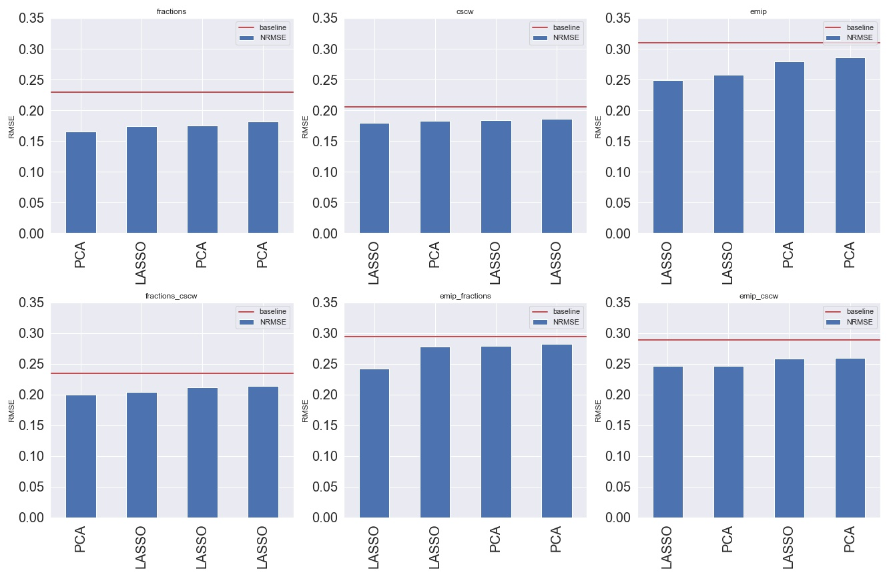
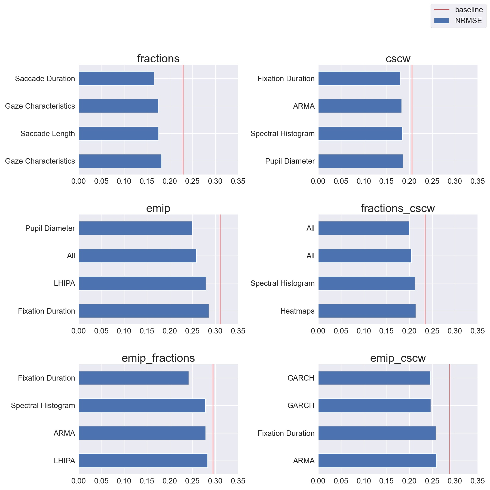

== Results
We ran a total of 216 pipelines with different combinations of datasets, dimensionality reduction, and feature groups.
144 of these pipelines were 1 to 1 pipelines, where we trained on one dataset and tested on another.
72 of them were 2 to 1 where we had two in-study datasets and 1 out of study.
In this section, we will present the results from these pipelines.
xref:baselines[] explains how we calculate the baselines for the datasets.
xref:generalizability[] looks at the more generalizable pipelines and which components these pipelines consists of. xref:context_sensitivity[] does the same only looking at the more context sensitive pipelines.

[[baselines]]
=== Baselines

The in-study baseline would be the NRMSE value if all the predictions were the labels' mean, regardless of the feature vectors.
We calculate a baseline for each of the dataset combinations and use these to evaluate the pipelines with the dataset combination as in-study.
We do this because the baselines differ between the datasets since the distribution of labels is different.
include::../tables/in_study_baselines_table.adoc[]

Pseudocode for the in-study baseline:
```
def get_baseline(labels):
    error = labels - labels.mean()
    error_squared = (error**2).mean()
    baseline = math.sqrt(error_squared)
    return baseline
```


[[same_training_and_testing_context]]
===  Same Training and testing context

==== Aggregation of the results
To evaluate how each dimensionality reduction method and each feature combination performs across all the pipelines, we need to aggregate the pipelines' results.
We do this by ranking, giving each pipeline a rank for NRMSE, then grouping on either dimensionality reduction, feature combination, then taking the average.
This mean of ranks gives us the results of which variables perform best when testing on the same context it was trained on.

====  Dimensionality reduction and feature selection
xref:pipelines_nrmses_dim_reduction[] shows which dimensionality reduction method is used for the pipelines with the 5 smallest NRMSES per dataset.
Which method performs better seems to rely heavily on the in-study dataset, making it hard to conclude which of the two performs better.

[[pipelines_nrmses_dim_reduction]]
.The pipelines with the 5 lowest NRMSES per dataset and if they used dimensionality reduction or feature selection


However, when we aggregate the results as seen in xref:one_to_one_dim_nrmse_aggregated[], and xref:two_to_one_dim_nrmse_aggregated[], we can see that Lasso performs slightly better than PCA across all 1 to 1 pipelines, and clearly better across the 2 to 1 pipelines.
So our results indicate that feature selection performs better than dimensionality in predicting cognitive performance on gaze-data in the same context.

[[one_to_one_dim_nrmse_aggregated]]
.NRMSE Rank and mean NRMSE for Dimensionality reduction and feature selection across all 1 to 1 pipelines
[format="csv", options="header"]
|===
include::../tables/results/1_to_1_dimensionality_reduction_samecontext_aggregated.csv[]
|===

[[two_to_one_dim_nrmse_aggregated]]
.NRMSE Rank and mean NRMSE for Dimensionality reduction and feature selection across all 2 to 1 pipelines
[format="csv", options="header"]
|===
include::../tables/results/2_to_1_dimensionality_reduction_samecontext_aggregated.csv[]
|===

==== Features


xref:pipelines_nrmses_features[] shows some overlap to which features work in both the 1 to 1 pipelines and 2 to 1 pipelines.
_FFT_ gave good predictions on _fractions_ and is also among the top 5 for _emip_fractions_ and _fractions_cscw_.
This pattern repeats for _cscw_ where _saccade_duration_ are among the top 5 in _cscw_, _fractions_cscw_ and _emip_cscw_.
For _EMIP_ this is shown with Arma.


[[pipelines_nrmses_features]]
.The pipelines with the 5 lowest NRMSES per dataset and which feature group it contained


When we aggregate the results, as seen in xref:[[one_to_one_features_nrmse_aggregated]] and xref:[[two_to_one_features_nrmse_aggregated]]. We see that Heatmaps is the best feature for training and testing on the same dataset for 1 to 1 pipelines, performing slightly better than _fixation_duration_ and _fft_.
However, _fixation_duration_ and _fft_ are also among the top five of the 2-to-1 pipelines, indicating that they are overall better choices. _Garch_ is the feature that performs best on the 2 to 1 pipelines.

[[one_to_one_features_nrmse_aggregated]]
.5 smallest NRMSE Rank and mean NRMSE for the feature groups across all 1 to 1 pipelines
[format="csv", options="header"]
|===
include::../tables/results/1_to_1_features_samecontext_aggregated.csv[]
|===

[[two_to_one_features_nrmse_aggregated]]
.5 smallest NRMSE Rank and mean NRMSE for the feature groups across all 2 to 1 pipelines
[format="csv", options="header"]
|===
include::../tables/results/2_to_1_features_samecontext_aggregated.csv[]
|===


[[generalizability]]
=== Generalizability
We evaluate the generalizability of the pipelines with the out of study dataset.
We compare the erros from predicting the out-of-study dataset to the cross-validation results with FGI, which we explained in chapter 4.
To find the most generalizable features, we need to filter out the pipelines that perform poorly on out-of-sample testing.
We do this by filtering out the pipelines that do not perform better than the baseline.
From 72 2-to-1 pipelines 28 beat the baseline.
We then sort the remaining pipelines on FGI.
Based on the sorting we separate these into three equally sized parts: generalizable pipelines, pipelines we are not able to say anything about, and context sensitive pipelines.

[[generalizable_pipelines]]
.Generalizable pipelines
[format="csv", options="header"]
|===
include::../tables/results/two_to_one_generalizable.csv[]
|===

xref:generalizable_pipelines[] shows the 10 most generalizable pipelines.
The first and most prevalent factor for generalizable pipelines is which datasets was the in study dataset.
When the in-study dataset is the combination of fractions and cscw, and emip is the out of study dataset, the pipelines are more generalizable.
Nine of the ten generalizable pipelines contains this combination of datasets.

For dimensionality reduction or feature selection Lasso is the most represented method among the more generalizable pipelines.
It is also included in the two pipelines with the lowest FGI.
However in combination with the feature group _all_ (ID 23, ID 22) and _heatmaps_ (ID 3, ID 2) PCA has a lower FGI than Lasso.
These are both very large feature groups containing hundreds of thousands of values, indicating that PCA keeps more of the variance than Lasso in the larger feature groups.

In the feature groups there is a high variety among the more generalizable pipelines.
However three feature groups shows up more than once, _all_, _heatmaps_ and _Garch_.
This indicates that they might be more generalizable feature groups.
_GARCH_ is also present the only pipeline with another in study dataset than fractions_cscw, that is emip_cscw.


[[context_sensitivity]]
=== Context Sensitivity
The bottom third of the filtered baselines, contains the pipelines that are more context specific.

[[context_sensitive_pipelines]]
.Context sensitive pipelines
[format="csv", options="header"]
|===
include::../tables/results/two_to_one_context_sensitivity.csv[]
|===


Again we can see that the dataset combination highly affects which pipelines are deemed context-sensitive, with a combination of emip_cscw and emip_fractions as in-study datasets.
Lasso has a majority in more context specific pipelines, however there are more pipelines with Lasso that beats the baseline than there are pipelines with PCA.
For the features we can see some difference from the generalizable pipelines.
_ARMA_, _LHIPA_, _eye_tracking_, and _pupil_diameter_, are present in the context-sensitive pipelines but not in the more generalizable ones.
Indicating that they are more context-sensitive features.
_Heatmaps_, _fft_, _markov_, _all_ and _saccade_length_ shows up in both, again indicating that dataset combination is an important variable for generalizability.
