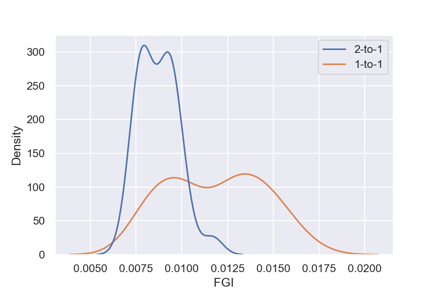

[[results]]
== Results

We ran a total of 216 pipelines with different combinations of datasets, methods for reducing the feature space, and feature groups.
144 of these pipelines were 1-to-1 pipelines, where we trained on only one dataset and tested on another.
72 of the pipelines were 2-to-1, where two datasets are designated in-study and one dataset designated out-of-study.
In this section, we will present the results from these pipelines.
In xref:baselines[], we explain how baselines for the different datasets are calculated.
xref:same_training_and_testing_context[] presents how pipelines performed in out-of-sample testing and which components performed the best overall by aggregating the results.
The pipelines that show generalizability are presented in xref:generalizability[].
The section also presents which components make up those pipelines.
Pipelines that exhibit more context-sensitivity are presented in xref:context_sensitivity[].

[[baselines]]
=== Baselines

We calculate a specific baseline for each dataset combination.
The baseline is equivalent to predicting the mean of the labels from the in-study dataset.
We then quantify this baseline by the NRMSE from those predictions.
The calculation of the baseline is done separately for each dataset combination.
Our pipelines are evaluated against the baseline for the given dataset combination.

.The baselines for each dataset combination
include::../tables/in_study_baselines_table.adoc[]

Pseudocode for the in-study baseline:
```
def get_baseline(labels):
    error = labels - labels.mean()
    error_squared = (error**2).mean()
    baseline = math.sqrt(error_squared)
    return baseline
```

[[same_training_and_testing_context]]
===  Out-of-Sample Testing

Our work focuses on engineering generalizable features.
This section outlines the results from the out-of-sample testing, which does not indicate generalizability.
However, the section is presented to the reader to benchmark the range of predictive power that our features exhibit in more traditional tasks.

==== Aggregation of the Results

To evaluate how each feature space reduction method and each feature combination performs across all the pipelines, we need to aggregate the pipelines' results.
We do this by ranking, giving each pipeline a rank for NRMSE, then grouping on feature space reduction method or feature group, and finding the median.
The _median of ranks_ gives us the results of what pipeline components perform best when testing in the same context it was trained.

====  Dimensionality Reduction and Feature Selection

xref:pipelines_nrmses_dim_reduction[] shows which method reduces the feature space for the pipelines with the five smallest NRMSEs per dataset.
Which method performs better seems to rely heavily on the in-study dataset, making it hard to conclude which of the two performs better.


[[pipelines_nrmses_dim_reduction]]
.The four best pipelines by NRMSE per dataset and whether they used PCA or LASSO.
image::../figures/dimensionality_reduction_context_sensitivity.jpg[]


However, when we aggregate the results as seen in xref:one_to_one_dim_nrmse_aggregated[], and xref:two_to_one_dim_nrmse_aggregated[], we can see that LASSO performs slightly better than PCA across all 1-to-1 pipelines, and clearly better across the 2-to-1 pipelines.
So our results indicate that feature selection performs better than dimensionality reduction in predicting cognitive performance on gaze data for out-of-sample testing.


[[one_to_one_dim_nrmse_aggregated]]
.Mean NRMSE and Median NRMSE Rank for PCA and LASSO for all 1-to-1 pipelines.
[format="csv", options="header"]
|===
include::../tables/results/1_to_1_dimensionality_reduction_samecontext_aggregated.csv[]
|===

[[two_to_one_dim_nrmse_aggregated]]
.Mean NRMSE and Median NRMSE Rank for PCA and LASSO for all 2-to-1 pipelines.
[format="csv", options="header"]
|===
include::../tables/results/2_to_1_dimensionality_reduction_samecontext_aggregated.csv[]
|===


==== Features

xref:pipelines_nrmses_features[] shows the best four pipelines by NRMSE and their feature groups.
It seems that several different feature groups perform quite well for the different dataset combinations.
We note that Fixation duration performs well in most combinations and that Spectral Histograms performs well in several pipelines, and All perform well, particularly for fractions_cscw.

[[pipelines_nrmses_features]]
.The four best pipelines by NRMSE per dataset and their feature group.
image::../figures/feature_groups_context_sensitivity.jpg[]


As seen in xref:one_to_one_features_nrmse_aggregated[] and xref:two_to_one_features_nrmse_aggregated[], when we aggregate the results, we see that Gaze Characteristics is the best feature group for out-of-sample testing amongst the 1-to-1 pipelines, performing slightly better than Spectral Histograms and Heatmaps.
2-to-1 pipelines that include Fixation duration seem to outperform other 2-to-1 pipelines, but GARCH also performs quite well.


[[one_to_one_features_nrmse_aggregated]]
.The five feature groups with the best median NRMSE Rank and their mean NRMSE across all 1-to-1 pipelines.
[format="csv", options="header"]
|===
include::../tables/results/1_to_1_features_samecontext_aggregated.csv[]
|===

[[two_to_one_features_nrmse_aggregated]]
.The five feature groups with the best median NRMSE Rank and their mean NRMSE across all 2-to-1 pipelines.
[format="csv", options="header"]
|===
include::../tables/results/2_to_1_features_samecontext_aggregated.csv[]
|===


[[generalizability]]
=== Generalizability

We evaluate the generalizability of the pipelines with the out-of-study dataset.
We compare the errors from making predictions on the out-of-study dataset to the out-of-sample results using FGI, explained in xref:feature_generalizability_index[].
In order to identify the most generalizable pipelines, we need to filter out pipelines that perform poorly in out-of-sample testing.
We do this by filtering out the pipelines that do not perform better than the baseline.
From 216 pipelines, 72 beat the baseline.

[[distribution_fgi]]
.Kernel Density Estimation plot of the FGI by pipeline type.


As represented in xref:distribution_fgi[], 2-to-1 pipelines are in general more generalizable than 1-to-1 pipelines.
This is in line with the results of citenp:[sharmaAssessingCognitivePerformance2020].
Our focus is generalizability, and as such, we will only refer to the 2-to-1 pipelines in the following sections.


[[generalizable_pipelines]]
.The 10 most generalizable pipelines.
[format="csv", options="header"]
|===
include::../tables/results/generalizable_pipelines.csv[]
|===

xref:generalizable_pipelines[] shows the 10 most generalizable pipelines.
The first and most prevalent factor for generalizable pipelines is which datasets were designated in-study datasets for that pipeline.
When the in-study dataset combines Fractions and CSCW (fractions_cscw), and EMIP is the out-of-study dataset, the pipelines are more generalizable.
Nine of the ten more generalizable pipelines contain this combination of datasets.

LASSO is the most represented method of feature space reduction among the more generalizable pipelines.
We note that there are more pipelines with LASSO that beat the baseline and might explain the trend we are seeing.
LASSO is also included in the two pipelines with the best FGI.
PCA performs very well for the feature groups ALL and heatmap; this might be explained by the fact that these are the largest feature groups with hundreds of thousands of values.

Seven of our twelve feature groups are represented among the ten most generalizable pipelines.
However, three feature groups show up more than once, ALL, Heatmaps, and GARCH.
This indicates that they might be more generalizable feature groups.
It should also be noted that GARCH is also the only pipeline with an in-study dataset that is not fractions_cscw of the ten most generalizable pipelines.

[[context_sensitivity]]
=== Context-Sensitivity

The bottom third of the filtered baselines contain the pipelines that are more context-specific.

[[context_sensitive_pipelines]]
.The 10 most context-sensitive pipelines.
[format="csv", options="header"]
|===
include::../tables/results/context_sensitive_pipelines.csv[]
|===

Again we can see that the dataset combination is an important factor in what pipelines exhibit context-sensitivity.
LASSO is more represented among the more context-specific pipelines.
As with the generalizable pipelines, there are more pipelines with LASSO that beat the baseline.
For the feature groups, we observe some differences from the generalizable pipelines.
ARMA, LHIPA, Gaze Characteristics, and Pupil Diameter are present in the context-sensitive pipelines but not in the more generalizable pipelines.
This indicates that these feature groups are more likely to produce context-sensitive pipelines.
Heatmaps, Spectral Histogram, Hidden Markov Models, ALL, and Saccade Length appear in generalizable and context-sensitive pipelines. This further supports the observation that dataset combination is an essential variable for generalizability.
