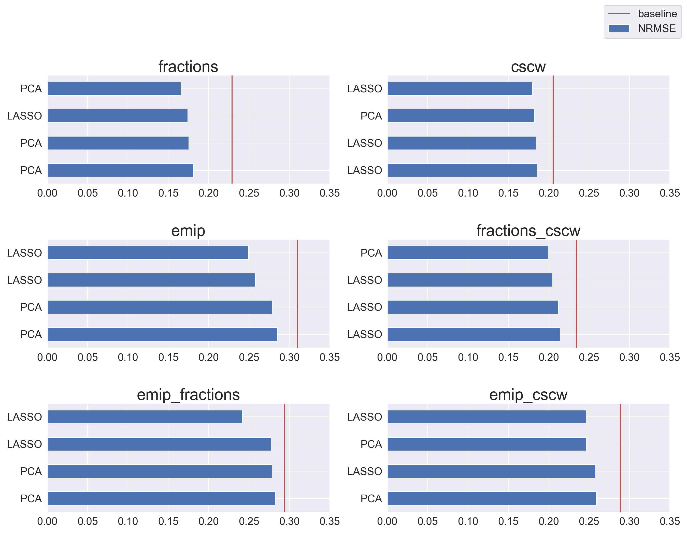

[[yolo]]
== Results and Discussion
We ran all different combinations of datasets, dimensionality reduction, and feature groups. xref:yolo[]

=== Baselines
We use two different baselines to evaluate our results, in study baseline and out of study baseline.

==== In study baseline
The in-study baseline is an essential error of something i need to find a reference for this.
We calculate a baseline for each of the dataset combinations and use these to evaluate the pipelines with the dataset combinations.
This is because the baselines differ between the datasets since the distribution of labels is different.
include::../tables/in_study_baselines_table.adoc[]

Pseudocode for the in-study baseline:
```
def get_baseline(labels):
    error = labels - labels.mean()
    error_squared = (error**2).mean()
    baseline = math.sqrt(error_squared)
    return baseline
```

==== Out of study baseline
We use a different method to calculate the out-of-study baselines.
We do this because the model has no a priori knowledge of the distribution of labels, and it would be a tremendous achievement to beat the baselines based on the mean.
We calculate the out-of-study baselines by taking the mean of the errors created by choosing values from a uniform and a normal distribution.


include::../tables/out_of_study_baselines.adoc[]

Pseudocode for the out-of-study baseline:
```
def get_random_normal_prediction(labels):
    prediction = [np.random.normal(loc=labels.mean(), scale=labels.std()) for i in labels]
    rmse_baseline = mean_squared_error(labels, prediction, squared=False)
    return rmse_baseline

def get_random_uniform_prediction(labels):
    prediction = [np.random.uniform(0,1) for i in labels]
    rmse_baseline = mean_squared_error(labels, prediction, squared=False)
    return rmse_baseline

def get_oos_baseline(labels):
    normal_rmses = [get_random_normal_prediction(labels) for i in range(300)]
    avg_normal_rmse= sum(normal_rmses)/len(normal_rmses)
    uniform_rmses = [get_random_uniform_prediction(labels) for i in range(300)]
    avg_uniform_rmse= sum(uniform_rmses)/len(uniform_rmses)
    return (avg_normal_rmse + avg_uniform_rmse)/2
```


=== Evaluating Generalizability
We evaluate the generalizability of the pipelines with the out of study dataset.
The results from predicting the out-of-study dataset are compared to the cross-validation results with FGI, which we explained in chapter 4.
To find the most generalizable features, we need to filter out the pipelines that perform poorly on both the in-study and out-of-study dataset since two models perform poorly may yield a good FGI.
We do this by filtering out the pipelines that do not perform better than the baseline on both in-study and out-of-study and rank the remaining pipelines on FGI.


=== Aggregation of the results
To evaluate how each dimensionality reduction method and each feature combination performs across all the pipelines, we need to aggregate the pipelines' results.
We do this by ranking, giving each pipeline a rank for NRMSE and FGI, then grouping on either dimensionality reduction, feature combination, or both, then taking the average.
This mean of ranks gives us the results of which variables produce the most generalizable pipelines and perform best in the same context.


=== Feature Selection and Dimensionality reduction


==== Same training and testing context
xref:pipelines_nrmses_dim_reduction[] shows which dimensionality reduction method is used for the pipelines with the 5 smallest NRMSES per dataset.
Which method performs better seems to rely heavily on the in-study dataset, and that makes it hard to conclude which of the two performs better.

[[pipelines_nrmses_dim_reduction]]
.The pipelines with the 5 lowest NRMSES per dataset and if they used dimensionality reduction or feature selection


However, when we aggregate the results as seen in xref:one_to_one_dim_nrmse_aggregated[], and xref:two_to_one_dim_nrmse_aggregated[], we can see that Lasso performs slightly better than PCA across all 1 to 1 pipelines, and clearly better across the 2 to 1 pipelines.
So our results indicate that feature selection performs better than dimensionality in predicting cognitive performance on gaze-data in the same context.

[[one_to_one_dim_nrmse_aggregated]]
.NRMSE Rank and mean NRMSE for Dimensionality reduction and feature selection across all 1 to 1 pipelines
[format="csv", options="header"]
|===
include::../tables/results/1_to_1_dimensionality_reduction_samecontext_aggregated.csv[]
|===

[[two_to_one_dim_nrmse_aggregated]]
.NRMSE Rank and mean NRMSE for Dimensionality reduction and feature selection across all 2 to 1 pipelines
[format="csv", options="header"]
|===
include::../tables/results/2_to_1_dimensionality_reduction_samecontext_aggregated.csv[]
|===


==== Generalizability

xref:pipelines_fgi_dim_reduction[] also has no clear indication to whether Lasso or PCA is the most generalizable.

[[pipelines_fgi_dim_reduction]]
.The pipelines with the 10 lowest FGI and if they used dimensionality reduction or feature selection
image::../figures/dimensionality_reduction_generalizability.jpg[]

When we aggregate the data shown in xref:one_to_one_dim_FGI_aggregated[] and xref:two_to_one_dim_FGI_aggregated[] we can see that Lasso is more generalizable than PCA in the 1 to 1 pipelines, interestingly the trend is the opposite in the 2 to 1 pipelines PCA generates slightly more generalizable pipelines than Lasso.
Hence our results shows that feature selection is preferred for 1 to 1 pipelines, while dimensionality reduction is more generalizable when training on mulitple contexts.

[[one_to_one_dim_FGI_aggregated]]
.FGI Rank and mean FGI for Dimensionality reduction and feature selection across all 1 to 1 pipelines
[format="csv", options="header"]
|===
include::../tables/results/1_to_1_dimensionality_reduction_generalizability_aggregated.csv[]
|===


[[two_to_one_dim_FGI_aggregated]]
.FGI Rank and mean FGI for Dimensionality reduction and feature selection across all 2 to 1 pipelines
[format="csv", options="header"]
|===
include::../tables/results/2_to_1_dimensionality_reduction_generalizability_aggregated.csv[]
|===


=== Feature groups

==== Same training and testing context


xref:pipelines_nrmses_features[] shows a that there is a

[[pipelines_nrmses_features]]
.The pipelines with the 5 lowest NRMSES per dataset and which feature group it contained
image::../figures/feature_groups_context_sensitivity.jpg[]

[[one_to_one_features_nrmse_aggregated]]
.10 smallest NRMSE Rank and mean NRMSE for the feature groups across all 1 to 1 pipelines
[format="csv", options="header"]
|===
include::../tables/results/1_to_1_features_samecontext_aggregated.csv[]
|===

[[two_to_one_features_nrmse_aggregated]]
.10 smallest NRMSE Rank and mean NRMSE for the feature groups across all 2 to 1 pipelines
[format="csv", options="header"]
|===
include::../tables/results/2_to_1_features_samecontext_aggregated.csv[]
|===


==== Generalizability
[[pipelines_fgi_features]]
.The pipelines with the 10 lowest FGI and which feature group they used


[[one_to_one_features_FGI_aggregated]]
.10 smallest FGI Rank and mean FGI for feature groups across all 1 to 1 pipelines
[format="csv", options="header"]
|===
include::../tables/results/2_to_1_features_generalizability_aggregated.csv[]
|===


[[two_to_one_features_FGI_aggregated]]
.10 smallest FGI Rank and mean FGI for feature groups across all 2 to 1 pipelines
[format="csv", options="header"]
|===
include::../tables/results/2_to_1_features_generalizability_aggregated.csv[]
|===
