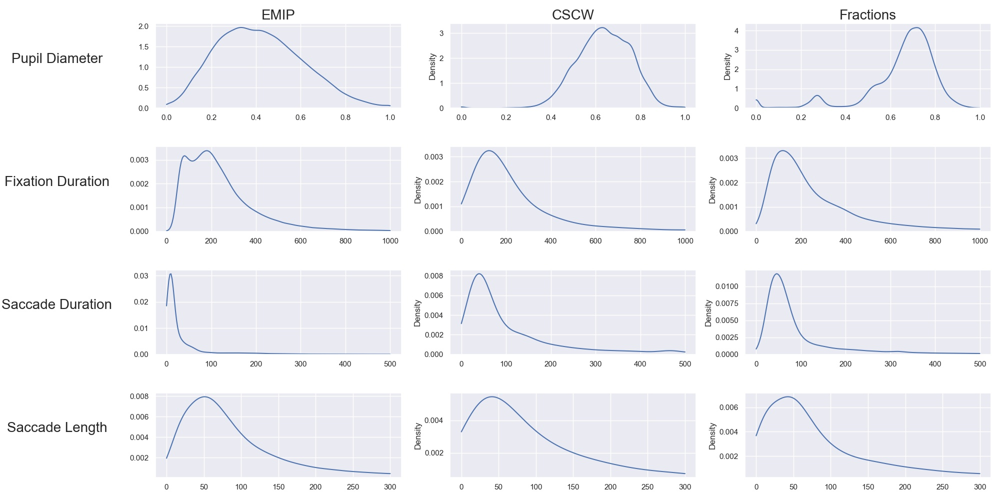

[appendix]
== Appendix

=== Code

Our code can be found at https://github.com/s0lvang/ideal-pancake. It is licensed under the MiT license so feel free to use it.
If there are any questions or bugs regarding the code, please open an issue.
The Asciidoc files for this thesis can be found at https://github.com/aslakhol/thesis.

=== Density Plots
xref:density_plot[] shows the density for all the values in the datasets and signals we use. The data is normalized as explained in xref:preprocessing[].

[[density_plot]]
.Density plots per signal and dataset

=== All Pipelines

[format="csv", options="header"]
|===
include::../tables/results/all_pipelines.csv[]
|===
